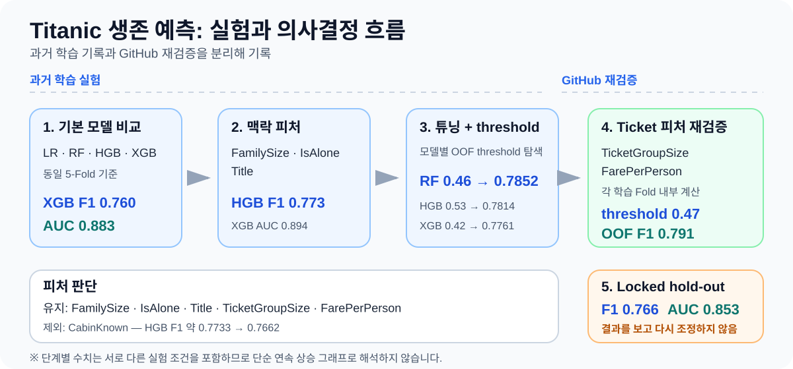
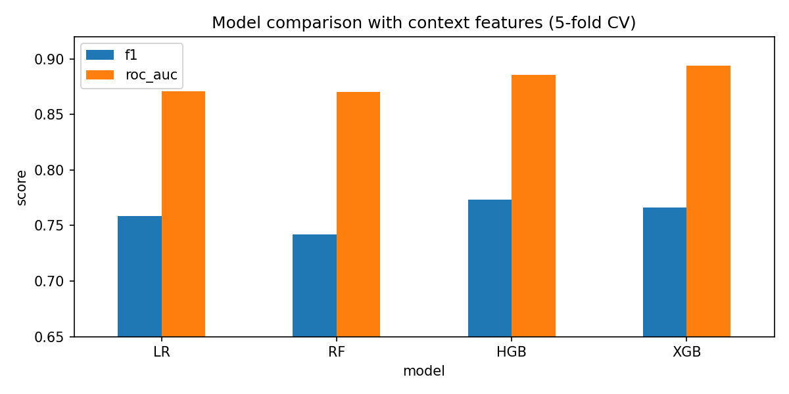
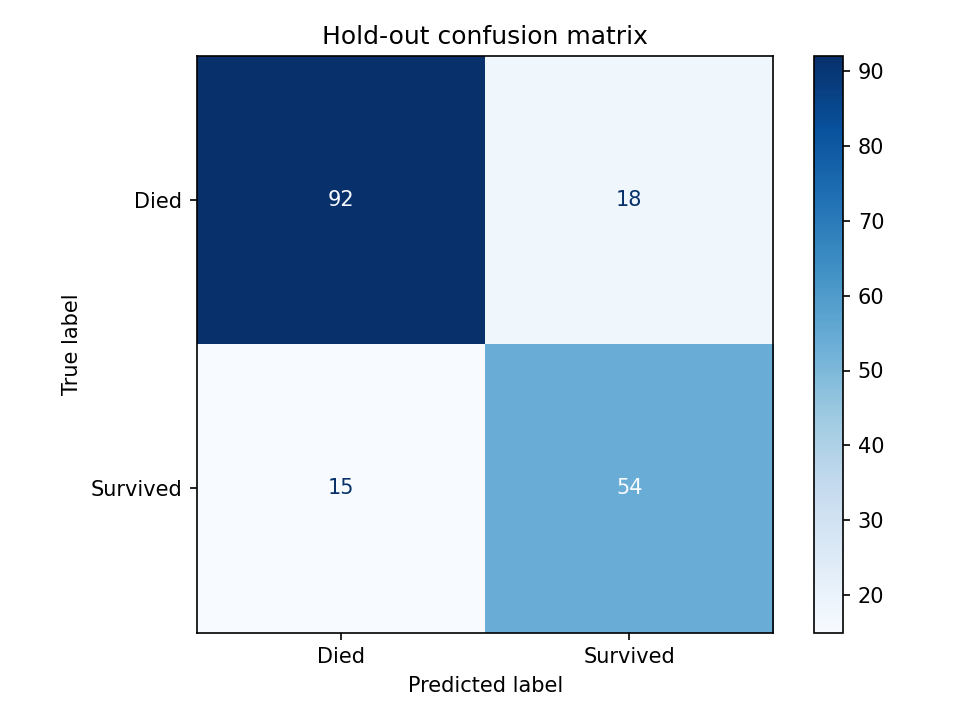

# Titanic Survival Prediction

Kaggle Titanic 데이터를 사용해 생존 여부를 예측한 머신러닝 실험입니다. 단순히 가장 높은 점수를 찾는 데서 끝내지 않고, **어떤 피처와 모델을 왜 시도했고 무엇을 근거로 유지·제외했는지**, 그리고 검증 데이터 누수를 어떻게 통제했는지를 함께 기록했습니다.

## 핵심 결과

현재 재검증한 최종 후보는 `FamilySize`, `IsAlone`, `Title`, `TicketGroupSize`, `FarePerPerson`을 사용하는 튜닝 Random Forest입니다. 개발 데이터의 OOF 예측에서 F1을 기준으로 threshold `0.47`을 선택했습니다.

| 평가 구간 | Accuracy | Precision | Recall | F1 | ROC-AUC |
|---|---:|---:|---:|---:|---:|
| 5-Fold OOF | 0.834 | 0.766 | 0.817 | **0.791** | - |
| 내부 hold-out | 0.816 | 0.750 | 0.783 | **0.766** | **0.853** |

내부 hold-out은 모델·피처·threshold 선택이 끝난 뒤 한 번만 평가했습니다. Kaggle test 데이터에는 정답이 없으므로 성능 평가가 아니라 `submission.csv` 생성에만 사용합니다.



> 위 흐름도는 과거 학습 당시 실험과 2026-08-27~28 GitHub 재검증을 구분합니다. 단계 사이의 숫자는 서로 다른 조건의 결과가 포함되어 있으므로 단순한 연속 성능 그래프로 해석하지 않습니다.

## 프로젝트에서 답하려 한 질문

이 프로젝트의 핵심은 “Random Forest가 몇 점을 냈는가?”보다 다음 질문에 답하는 과정입니다.

- Accuracy만 높으면 좋은 모델이라고 볼 수 있는가?
- 가족 구성이나 호칭처럼 원본 데이터에 직접 없는 맥락을 어떻게 피처로 표현할 수 있는가?
- 그럴듯한 파생 피처가 실제 교차검증에서도 도움이 되는가?
- 기본 모델 비교에서 앞선 모델이 튜닝과 threshold 조정 뒤에도 최종적으로 앞서는가?
- Ticket처럼 다른 승객과의 관계를 사용하는 피처를 데이터 누수 없이 계산할 수 있는가?
- 마지막 hold-out 성능이 기대보다 낮아도 다시 모델을 맞춰야 하는가?

## 의사결정 흐름

| 단계 | 질문 | 결정 |
|---|---|---|
| 검증 설계 | Kaggle test를 검증에 써도 되는가? | train 내부에서 development / hold-out 분리 |
| 평가 기준 | Accuracy 하나면 충분한가? | F1을 주요 선택 지표로 두고 ROC-AUC 등 보조 확인 |
| 모델 탐색 | 한 모델만 바로 튜닝할 것인가? | LR · RF · HGB · XGB를 동일 5-Fold에서 비교 |
| 맥락 피처 | 원본 변수만으로 충분한가? | `FamilySize` · `IsAlone` · `Title` 추가 |
| 실패 실험 | `CabinKnown`은 도움이 되는가? | HGB F1이 약 0.7733 → 0.7662로 하락해 제외 |
| 모델 선택 | HGB/XGB가 초기 결과에서 강한데 왜 RF인가? | 튜닝 + 모델별 OOF threshold 비교 후 RF F1 약 0.7852로 최종 후보 선택 |
| 재검증 | Ticket 피처를 안전하게 쓸 수 있는가? | Fold 내부에서 `TicketGroupSize` 계산, `FarePerPerson` 추가 |
| threshold | 0.5를 그대로 쓸 것인가? | OOF F1 기준 `0.47` 선택 |
| 최종 평가 | hold-out 결과를 보고 다시 조정할 것인가? | 마지막 1회 평가 후 재선택하지 않음 |

> 과거 학습 당시의 실험과 2026-08-27~28 GitHub 정리 과정에서 다시 검증한 실험은 구분해 기록했습니다. 과거 기록에 없는 선택 이유는 사후에 만들어 넣지 않았습니다.

### 자세한 기록

- [Decision Log — 왜 그렇게 선택했는가](docs/decision-log.md)
- [Experiment History — 무엇을 어떤 순서로 실험했는가](docs/experiment-history.md)

## 모델 선택 과정에서 중요했던 변화

기본 피처에서는 XGBoost가 F1 `0.760`, ROC-AUC `0.883`으로 가장 강했습니다. `FamilySize`, `IsAlone`, `Title`을 추가한 뒤에는 HGB가 F1 `0.773`, XGB가 ROC-AUC `0.894`를 기록했습니다.

하지만 과거 학습 과정에서 RF를 RandomizedSearchCV로 튜닝하고 RF/HGB/XGB 각각에 대해 OOF threshold를 다시 탐색했을 때 결과는 다음과 같았습니다.

| 모델 | Threshold | F1 |
|---|---:|---:|
| Tuned RF | **0.46** | **0.7852** |
| HGB | 0.53 | 0.7814 |
| XGB | 0.42 | 0.7761 |

따라서 RF는 기본 모델 비교에서 처음부터 최고였기 때문에 선택한 것이 아니라, **튜닝과 threshold 재비교 이후 F1 기준으로 가장 높은 결과를 기록해 당시 최종 후보가 되었습니다.**

이후 GitHub 재검증 단계에서는 Ticket 피처를 Fold-safe하게 다시 구현하고 `FarePerPerson`을 추가해 OOF F1 `0.791`, threshold `0.47`을 얻었습니다.





## Feature Engineering: 채택뿐 아니라 제외도 기록

### 핵심 유지 피처

- `FamilySize`: 함께 탑승한 가족 규모
- `IsAlone`: 혼자 탑승했는지 여부
- `Title`: 이름에서 추출한 사회적 호칭
- `TicketGroupSize`: 같은 Ticket을 공유하는 승객 규모
- `FarePerPerson`: 그룹 규모를 고려한 1인당 운임 근사값

### 실험했지만 최종 구성에 모두 남기지 않은 피처

- `CabinKnown`
- `Surname`
- `FamilySurvival`
- `AgeGroup`
- `Mother`

특히 `CabinKnown`은 도메인상 의미가 있을 것이라는 가설로 실험했지만 과거 기록에서 HGB F1이 약 `0.7733`에서 `0.7662`로 하락해 제외했습니다. **피처가 그럴듯하다는 이유만으로 유지하지 않고 검증 결과를 기준으로 판단했습니다.**

## 검증 설계

```text
Kaggle train 891
│
├─ development 712
│   └─ Stratified 5-Fold CV
│       ├─ 모델 비교
│       ├─ Feature Engineering
│       ├─ Hyperparameter tuning
│       └─ OOF threshold 선택
│
└─ hold-out 179
    └─ 모든 선택이 끝난 뒤 1회 평가

Kaggle test 418
└─ 최종 모델 재학습 후 submission 생성에만 사용
```

- `titanic_train.csv`를 개발 데이터 80%와 내부 hold-out 20%로 계층 분할했습니다.
- 개발 데이터에서 `StratifiedKFold` 5-Fold 교차검증을 수행했습니다.
- 결측치 처리, 스케일링, one-hot encoding은 Pipeline 안에서 Fold별로 학습했습니다.
- `TicketGroupSize`도 custom transformer를 통해 각 학습 Fold에서만 계산합니다.
- threshold는 개발 데이터 OOF 확률에서만 선택했습니다.
- 선택 완료 후 내부 hold-out을 한 번 평가하고, 전체 train으로 다시 학습해 Kaggle 제출 예측을 만들었습니다.

## 현재 결과를 해석할 때의 한계

### Ticket 피처

교차검증에서 학습 Fold에 없던 Ticket은 그룹 크기 1로 처리합니다. 다만 승객 단위 무작위 분할을 사용했기 때문에 같은 Ticket의 승객이 서로 다른 Fold에 배치될 수 있습니다. 따라서 동행 정보의 일반화 가능성에는 제약이 있습니다.

### 최종 모델 비교 범위

현재 Ticket 피처를 적용한 튜닝 RF의 OOF F1 `0.791`은 **현재 수행한 실험 중 가장 높은 결과**입니다. Ticket 피처를 동일하게 적용한 HGB와 XGB까지 다시 비교한 것은 아니므로 “모든 모델 중 최적”이라고 해석하지 않습니다.

### hold-out

OOF F1 `0.791`에 비해 hold-out F1은 `0.766`으로 낮았습니다. 하지만 이 값을 보고 다시 threshold나 모델을 수정하지 않았습니다. hold-out을 다시 개발 데이터처럼 사용하지 않기 위해서입니다.

## 다음 실험 후보

- Ticket 단위 group split과 현재 승객 단위 split 비교
- 동일한 Ticket 피처 조건에서 RF · HGB · XGB 재비교
- 파생 피처별 ablation table 작성
- 여러 random seed에서 평균·표준편차 확인
- probability calibration과 threshold 안정성 확인

이 항목들은 현재 결과의 문제를 숨기기 위한 것이 아니라 **어디까지 검증했고 다음에 무엇을 확인해야 하는지 명확히 남기기 위한 백로그**입니다.

## 저장소 구조

```text
titanic-survival-prediction/
├── README.md
├── requirements.txt
├── notebooks/
│   └── titanic_survival_modeling.ipynb
├── docs/
│   ├── decision-log.md
│   └── experiment-history.md
├── data/
│   └── README.md
└── assets/
    ├── experiment_decision_flow.svg
    ├── model_comparison.png
    └── confusion_matrix.png
```

CSV와 `submission.csv`는 Git에서 제외됩니다.

## 실행 방법

Python 3.12 환경을 권장합니다.

```powershell
python -m venv .venv
.venv\Scripts\Activate.ps1
python -m pip install -r requirements.txt
```

[Kaggle Titanic 데이터 페이지](https://www.kaggle.com/competitions/titanic/data)에서 `train.csv`, `test.csv`를 내려받아 각각 다음 이름으로 배치합니다.

```text
data/titanic_train.csv
data/titanic_test.csv
```

Jupyter 또는 VS Code에서 `notebooks/titanic_survival_modeling.ipynb`를 열고 모든 셀을 순서대로 실행하면 다음 파일이 생성됩니다.

```text
assets/model_comparison.png
assets/confusion_matrix.png
submission.csv
```
